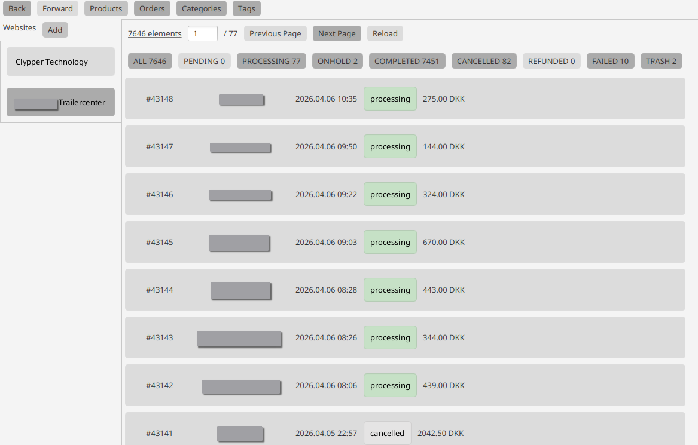
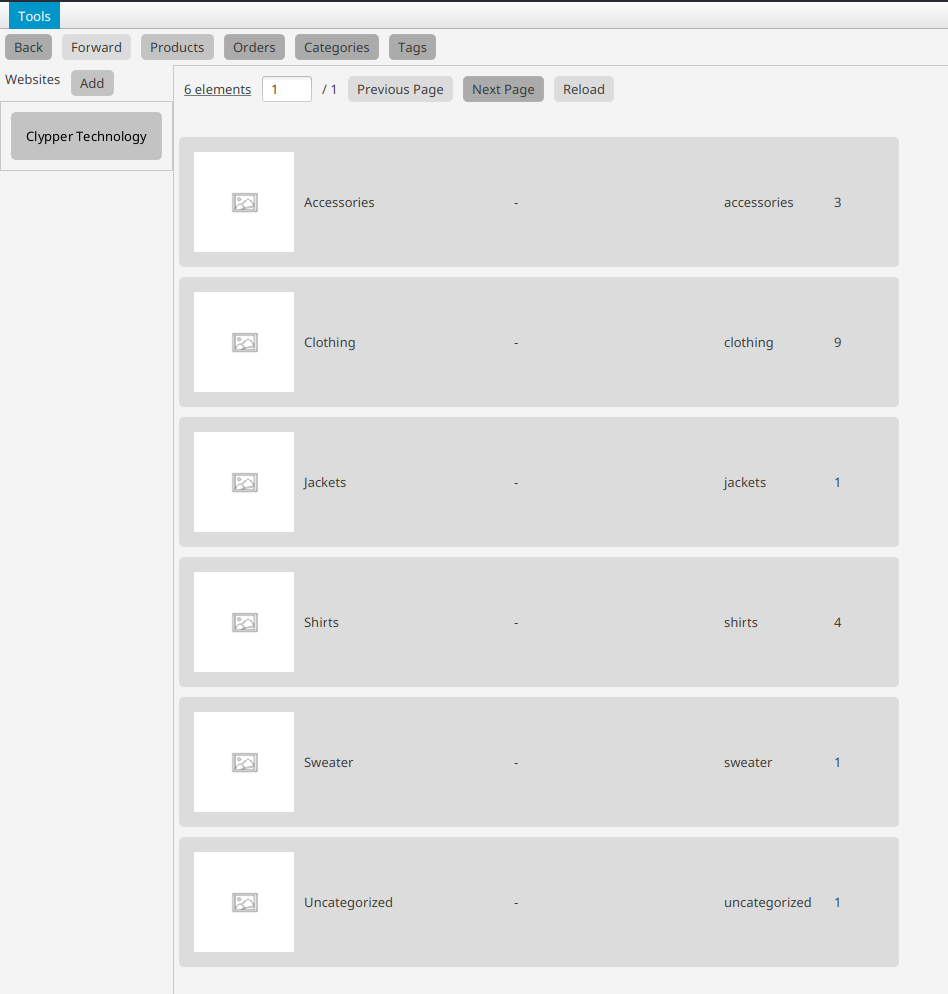
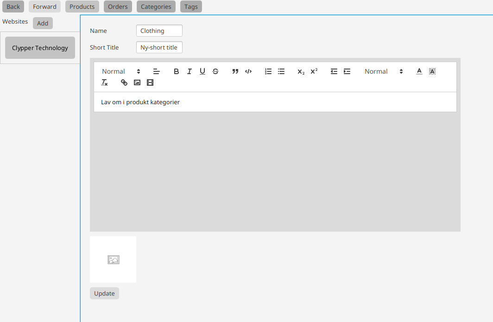

# WooCommerce Remote Manager

A JavaFX Desktop application, that allows you to manage multiple WooCommerce based stores at the same time.
Add all of your stores to a unified dashboard, and manage orders, products, categories and tags from the same place
across websites.

## Products, Orders, Catergories

WooCommerce Remote Manager connects to your WooCommerce website through its REST API, and thus achieves better performance
than the standart web-interface through WordPress. This offloads resources from your website, and allows your own
computer to do more of the heavy lifting. This also results in decreased loading times for both you, and your customers,
as well as a faster store administration workflow.

 
